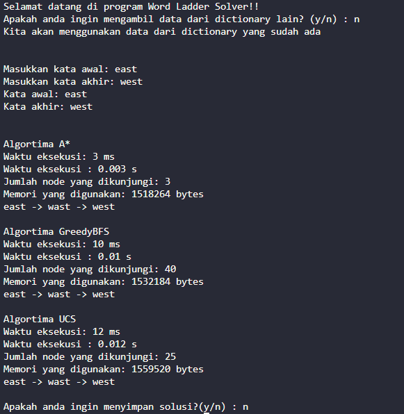

# Tucil 3 IF2211 Strategi Algoritma : Penyelesaian Permainan Word Ladder Menggunakan Algoritma UCS, Greedy Best First Search, dan A*


## General Information
Program dalam repository ini adalah program yang dapat digunakan untuk menyelesaikan permainan [Word Ladder](https://wordwormdormdork.com/) dengan algoritma Uniform Cost Search, Greedy Best First Search, dan A*. 


## Technologies Used
-  [Java SE 21.0.2](https://www.oracle.com/java/technologies/javase/jdk21-archive-downloads.html)


## Features
- Penyelesaian permainan Word Ladder menggunakan algoritma Uniform Cost Search
- Penyelesaian permainan Word Ladder menggunakan algoritma Greedy Best First Search
- Penyelesaian permainan Word Ladder menggunakan algoritma A*


## Screenshots



## Setup
1. Clone repository
```sh
git clone https://github.com/TuanOnta/Tucil3_13522149
```
2. Change directory ke root dir projek
```sh
cd Tucil3_13522149
```
3. Kompilasi program (tidak perlu jika sudah menggunakan Java 21.0.2)
```sh
# untuk sistem operasi Windows
./compile.bat

# untuk sistem operasi Linux atau WSL
./compile.sh

```
4. Menjalankan program
```sh
# untuk sistem operasi Windows
./run.bat

# untuk sistem operasi Linux atau WSL
./run.sh
```


## Usage
```sh
Selamat datang di Word Ladder Solver!
Apakah anda ingin mengambil data dari dictionary lain? (y/n) : <input>


Masukan kata awal: <input>
Masukan kata akhir: <input>
```

## Author
[Muhammad Dzaki Arta 13522149](https://github.com/TuanOnta)